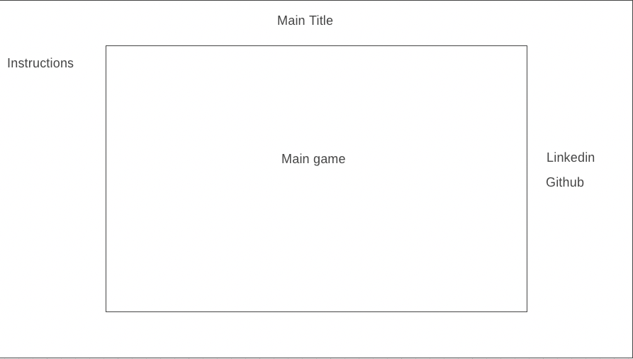

# Build-A-Burger

## Background
Build-A-Burger is a game where you work as a short order cook. It's the lunch rush, and you're the only one on the line today. Get as many of those burgers out as possible, and don't burn anything.

## Functionality
In Build-A-Burger, users will be able to: 

* Click and drag ingredients
* Keep a score
* Assemble burgers
* Have some form of timer on the cooking of the burgers

## Wireframes

## Technologies, Libraries, APIs
This project is implemented with these technologies:
* Canvas to render the view

## Implementation Timeline
* Friday - Initial setup of the project. Get used to Three.js and how to manipulate meshes, shapes, and rotations. Attempt to render a background and kitchen.

* Saturday - Learn more about Three.js. Render all ingredients to the view.

* Sunday - Figure out the implementation of classes for each ingredient. Work on underlying code for the classes and objects.

* Monday - If there are bugs (more than likely will be), fix them. Ensure all code is working before attempting to render more objects and add more complexity. Work on burger class.

* Tuesday - Add collision and stackability for the burgers on the view. Ensure scores can be updated and that burgers can be sent out.

* Wednesday - Styling the page and making sure everything looks pretty.

* Thursday Morning - Work out any remaining problems and push to Github.